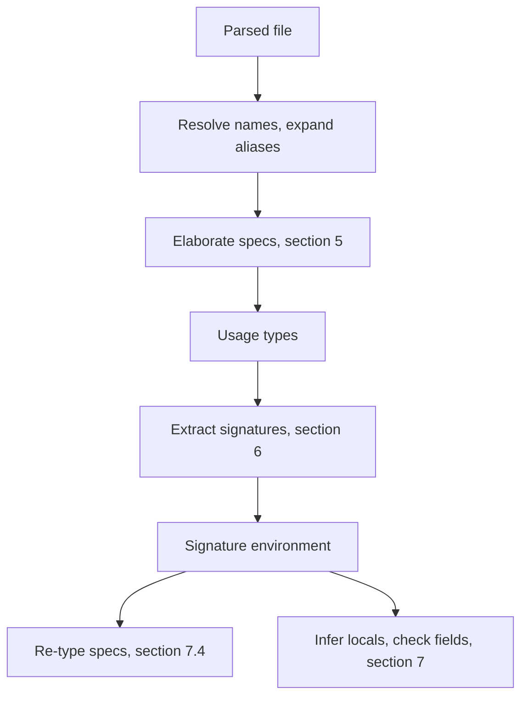

```mermaid
flowchart TD
    A[Parsed file] --> B[Resolve names, expand aliases]
    B --> C[Elaborate specs, section 5]
    C --> D[Usage types]
    D --> E[Extract signatures, section 6]
    E --> F[Signature environment]
    F --> G[Re-type specs, section 7.4]
    F --> H[Infer locals, check fields, section 7]
```